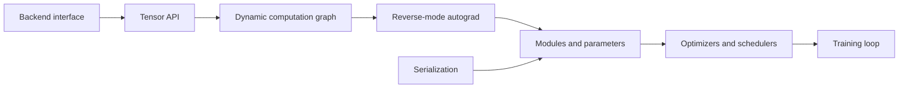

# NeuroForge

NeuroForge is a small neural network framework implemented from first principles in Python and NumPy.  It is built around an eager autograd engine, explicit module/parameter ownership, optimizer state, checkpointing, and a backend boundary designed for future accelerator kernels.

The project is intentionally compact, but the architecture mirrors the pressure points of larger systems: graph construction, gradient accumulation, module serialization, training ergonomics, and the shape discipline required by attention and convolutional models.



## Highlights

- NumPy-backed `Tensor` with reverse-mode automatic differentiation
- Broadcasting-aware backpropagation, slicing gradients, batched matmul, concat/stack
- Module system with recursive parameter tracking and state dictionaries
- Layers: `Linear`, `Conv2D`, `Embedding`, `BatchNorm1D`, `LayerNorm`, `Dropout`
- Sequence/modeling blocks: `RNN`, `LSTM`, multi-head attention, Transformer encoder block
- Optimizers: SGD, momentum, RMSProp, Adam, AdamW
- Schedulers: step, exponential, cosine annealing
- Training utilities: metrics, trainer, YAML config, checkpoints
- Examples for MNIST, CIFAR-shaped CNNs, LSTM language modeling, and tiny GPT-style training
- Tests, benchmarks, CI, pre-commit config, contribution docs, issue and PR templates

## Install

```bash
python -m venv .venv
source .venv/bin/activate
pip install -e ".[dev]"
pytest
```

## Quick Start

```python
import numpy as np

from neuroforge import Tensor
from neuroforge.nn import Linear, ReLU, Sequential, mse_loss
from neuroforge.optim import AdamW

model = Sequential(Linear(4, 32), ReLU(), Linear(32, 1))
opt = AdamW(model.parameters(), lr=1e-3)

x = Tensor(np.random.randn(64, 4).astype("float32"))
y = Tensor(np.random.randn(64, 1).astype("float32"))

for _ in range(100):
    loss = mse_loss(model(x), y)
    opt.zero_grad()
    loss.backward()
    opt.step()
```

## Repository Layout

```text
src/neuroforge/
  backend/      Backend interfaces and NumPy implementation
  tensor.py     Tensor abstraction and autograd engine
  nn/           Modules, layers, losses, recurrent and attention blocks
  optim/        Optimizers and learning-rate schedules
  training/     Trainer, checkpoints, metrics, config
examples/       End-to-end training scripts
benchmarks/     Performance probes
docs/           Architecture and roadmap notes
tests/          Unit and regression tests
```

## Design Notes

The framework keeps array storage and kernel execution behind a backend boundary.  Today that backend is NumPy.  The autograd layer records operations using small backward closures and does not assume NumPy beyond the concrete arrays it receives, which keeps the route to CUDA/OpenCL-style storage plausible.

This is not trying to be a PyTorch replacement.  The goal is a readable research-engineering substrate: enough fidelity to train real small models, enough structure to scale the internals, and enough tests to make refactors survivable.

## Examples

```bash
python examples/mnist_classifier.py
python examples/cifar_like_cnn.py
python examples/char_lm.py
python examples/tiny_gpt.py
python examples/transformer_demo.py
python benchmarks/bench_autograd.py --steps 100
```

## Status

NeuroForge is at `0.1.0`: usable for small CPU experiments and framework internals work.  The next milestones are vectorized convolution backward, explicit device handles, graph profiling, mixed precision, and a compiled backend prototype.

## License

MIT.  See [LICENSE](LICENSE).
