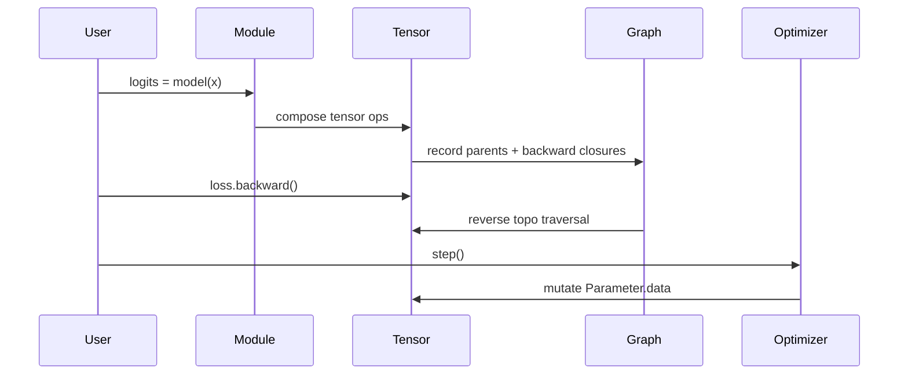

# Architecture

NeuroForge is organized around four boundaries:

1. **Tensor storage**: `Tensor` owns array data and gradient buffers.
2. **Autograd graph**: eager operations attach backward closures and parent edges.
3. **Module ownership**: `Module` recursively discovers `Parameter` instances for optimization and serialization.
4. **Backend dispatch**: `backend/` defines the narrow interface future array backends must satisfy.

## Autograd

Each differentiable operation creates a result tensor with:

- references to parent tensors
- an operation label for debugging
- a backward closure that reads `out.grad` and accumulates parent gradients

The topological traversal starts from the scalar loss and walks parents exactly once.  Gradients accumulate because shared parameters can be used multiple times in a graph.

## Modules

`Module.parameters()` walks nested modules, lists, tuples, and dictionaries.  There is no metaclass or global registry; the object graph is the ownership graph.  This keeps the API simple while still supporting nested Transformer blocks and custom user modules.

## Backends

Only the NumPy backend is implemented today.  The next backend pass should introduce:

- device-aware array allocation
- explicit copy semantics
- backend-owned kernels for matmul, conv, norm, and reductions
- a compatibility test matrix that reuses the same autograd tests across backends

The current code deliberately isolates convolution loops inside `nn.layers.conv2d` so a vectorized or compiled kernel can replace that path cleanly.
